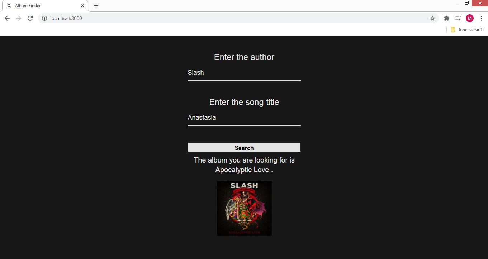

# Album-Finder
## Table of contents
* [Goal of the project](#goal-of-the-project)
* [Technologies](#technologies)
* [Launching the application](#launching-the-application)
## Goal of the project:
The user provides the artist and the song title, on the basis of which the application will search for the album without interaction with the user. Search is done by entering the website: https://genius.com, using the chromium engine in headless mode, i.e. without a graphic interface. After finding the desired album, its title and cover are presented with redirection to the genius.com website.<br>
Below are two screenshots showing the operation of the application. The first shows the status before, while the second shows the status after the search:<br>
 <br>

## Technologies:
* body-parser: 1.19.0<br>
* express: 4.17.1<br>
* puppeteer: 5.3.1<br>
* nodemon: 2.0.4<br>
The server service is carried out in the Node environment with the Express framework, while the main operation is carried out using the Puppeteer library. For convenient use, I use the Nodemon tool, which is responsible for the automatic restart of the Node application.
## Launching the application:
To run this application, install it locally using npm:<br>
```
$ npm install
$ npm run dev
```
